# AI Native Design Concept

## Autonomous Development with GitHub Copilot Orchestration

### Vision Statement

An AI-first development environment where GitHub Copilot agents autonomously manage the entire software development lifecycle, from code generation to story creation, while the Human-in-the-Middle (HITM) focuses exclusively on high-value strategic decisions and creative direction.

## 🎯 **Epic 1 Achievement Status (August 2025)**

### ✅ **V1 Foundation Complete**
- **13 V1 Agents Archived**: Safe transition with full code preservation (3,827 lines)
- **Operational Infrastructure**: 11-agent ecosystem with production validation
- **100% Success Rate**: Epic → Stories → Tasks → PR → Merge workflow
- **Enterprise Foundation**: AWS Well-Architected framework and compliance ready

### 🚀 **V2 Transition Ready**
- **Intelligence Evolution**: From automation to GitHub Copilot + Claude 4 intelligence
- **AI Native Validation**: All core principles proven through V1 operational success
- **Production Infrastructure**: Rate limiting, monitoring, and orchestration systems operational
- **Epic 2 Foundation**: Zero human scaffolding achieved, ready for intelligent autonomous development

---

## Core AI Native Principles

### 1. **Zero Human Scaffolding**

- GitHub Copilot Workspace automatically generates project structure
- AI agents bootstrap new features from natural language requirements
- Autonomous dependency management and version updates
- Self-generating documentation and API specifications

### 2. **Autonomous Code Management**

- GitHub Copilot creates and manages feature branches automatically
- AI-driven code reviews and refactoring suggestions
- Automatic bug detection and resolution
- Self-healing code that adapts to changing requirements

### 3. **Intelligent Test Orchestration**

- GitHub Actions with AI-generated test suites
- Copilot writes tests before implementation (TDD by default)
- Self-optimizing test coverage and performance benchmarks
- Automated regression testing and quality gates

### 4. **Story Generation Pipeline**

- AI agents automatically generate story content from themes
- GitHub Projects integration for narrative planning and tracking
- Automated content review and consistency checking
- Dynamic story adaptation based on user engagement metrics

### 5. **Self-Optimizing Architecture**

- Real-time performance monitoring with AI-driven optimizations
- Automatic infrastructure scaling and cost optimization
- AI-powered security vulnerability scanning and patching
- Continuous architectural refactoring based on usage patterns

### 6. **Live AI Agent Testing & Fine-Tuning**

- Real-time A/B testing of AI model parameters and prompts
- Interactive agent behavior adjustment through monitoring dashboard
- Live experimentation with different AI providers and configurations
- Automated prompt optimization based on output quality metrics

### 7. **Comprehensive Agent Monitoring & Observability**

- Single pane of glass dashboard for all AI agent activities
- Real-time inter-agent communication tracking
- Centralized logging and debugging across all environments
- Performance metrics and cost analysis for each AI operation

### 8. **Secure Secret Management & Pre-commit Safety**

- Zero secret exposure with automated pre-commit scanning
- Environment-specific secret injection through AWS Systems Manager
- OpenAI API key rotation and usage monitoring
- Comprehensive audit trails for all AI operations

---

## GitHub Copilot Integration Architecture

### Development Orchestration Agent

```yaml
Agent: GitHub Copilot Workspace
Responsibilities:
  - Epic breakdown into Stories and Tasks with AI Agent Orchestrator
  - Story implementation from No Status → Done with automated branching
  - Code review and quality assurance through GitHub Actions
  - Documentation generation and maintenance

Triggers:
  - Epic Issues labeled "epic" with AI Agent Orchestrator comments
  - Story progression through Scrum Master Agent workflows
  - Automated Development Agent handoffs from comment triggers
  - GitHub Project status transitions

✅ IMPLEMENTED - Epic 1 Status:
  - Epic Breakdown Agent: Multi-mode operation (hardcoded, hybrid, AI native)
  - Scrum Master Agent: Story status management (No Status → To Do)
  - Development Agent: Complete story implementation with branching
  - GitHub Projects Integration: Full Project ID 2 automation
  - End-to-End Testing: Story #54 successful lifecycle completion

Example Workflow (VALIDATED):
  1. HITM creates Epic: "AI Agent Observatory Dashboard"
  2. Epic Breakdown Agent creates 8 Stories + 24 Tasks automatically
  3. Scrum Master Agent moves Story from No Status → To Do
  4. Development Agent creates branch, implements features, opens PR
  5. Story automatically transitions to Done with full audit trail
  6. All changes tracked in GitHub Project Kanban view
```

### Story Content Generation Agent

```yaml
Agent: GitHub Copilot + GPT-4 Integration
Responsibilities:
  - Generate story beats from narrative themes
  - Maintain character consistency across storylines
  - Create branching dialogue trees
  - Optimize narrative pacing and engagement

Integration Points:
  - GitHub Projects for story planning and tracking
  - Issues for story bug reports and enhancement requests
  - Discussions for collaborative story development
  - Actions for automated content quality checks

Example Workflow:
  1. HITM sets story theme: "Mysterious train journey at night"
  2. Agent generates 50+ story beats with Y/N choices
  3. Creates GitHub Project with story progression map
  4. Automatically tests narrative consistency
  5. Generates preview builds for stakeholder review
  6. Iterates based on engagement analytics
```

### Infrastructure Optimization Agent

```yaml
Agent: GitHub Actions + AWS AI Services
Responsibilities:
  - Monitor application performance in real-time
  - Optimize AWS infrastructure costs automatically
  - Scale resources based on usage patterns
  - Implement security patches and updates

Automation Examples:
  - Lambda function right-sizing based on execution metrics
  - CloudFront cache optimization for story content
  - Bedrock model selection for cost/quality balance
  - Auto-scaling story generation capacity
```

---

## AI Native Development Workflows

### Feature Development Cycle

```mermaid
graph TD
    A[HITM Creates Epic Issue] --> B[Epic Breakdown Agent Analyzes]
    B --> C[Generate Stories + Tasks in GitHub Project]
    C --> D[Scrum Master Agent: No Status → To Do]
    D --> E[Development Agent: Auto-Branch Creation]
    E --> F[Implement Features + Database Schema]
    F --> G[Create PR with Analysis + Screenshots]
    G --> H[Automated Quality Gates + Testing]
    H --> I[Project Status: To Do → In Progress → Done]
    I --> J[Performance Monitoring + Optimization]

    subgraph "✅ VALIDATED - Epic 1"
        K[Epic Issue #60: AI Agent Observatory]
        L[8 Stories + 24 Tasks Generated]
        M[Story #54: Complete Lifecycle]
        N[Database Schema Generated]
        O[PR Created with Documentation]
        P[GitHub Project Automation]
    end
```



### Story Content Lifecycle


### Bug Resolution Process


---

## GitHub Platform Integration

### GitHub Projects for Story Management

```yaml
✅ OPERATIONAL PROJECT STRUCTURE (Project ID: 2 - "Noveli"):
  Epic Management:
    - Columns: Epic Planning → Epic Breakdown → Epic Validation → Epic Complete
    - Automated Epic → Stories → Tasks generation
    - Epic Breakdown Agent handles multi-mode operation
    - Epic #60 "AI Agent Observatory" successfully processed

  Story Lifecycle:
    - Columns: No Status → To Do → In Progress → Done
    - Scrum Master Agent manages transitions
    - Development Agent handles implementation
    - Story #54 completed full end-to-end automation

  Task Tracking:
    - Automated task generation from story analysis
    - 24 tasks generated for Epic #60 Observatory
    - Granular progress tracking and validation
    - Database schema tasks automatically created

🔧 CURRENT CHALLENGES IDENTIFIED:
  Kanban Status Alignment:
    - Visual GitHub Project shows stories jumping No Status → Done
    - Missing intermediate status display (To Do, In Progress)
    - Bug documented in kanban-status-bug-notes.md
    - GitHub API rate limiting preventing immediate issue creation

📈 SUCCESS METRICS (Epic 1 Validated):
  - Epic Breakdown: 100% automation success rate
  - Story Generation: 8 stories created automatically
  - Task Generation: 24 tasks with proper categorization
  - Project Integration: Seamless GitHub Project operations
  - Agent Coordination: Successful multi-agent workflows
```

### GitHub Discussions for Collaborative AI

```yaml
Categories:
  Story Brainstorming:
    - AI agents contribute story ideas and themes
    - Collaborative filtering of concepts
    - Automated theme extraction and clustering

  Architecture Decisions:
    - AI-driven architectural recommendations
    - Performance impact analysis
    - Automated decision documentation

  User Feedback Analysis:
    - AI summarization of user feedback
    - Sentiment analysis and trend detection
    - Automated action item generation
```

### GitHub Actions AI Workflows

```yaml
✅ OPERATIONAL WORKFLOWS:
  epic-breakdown-agent.yml:
    - Triggered by Epic Issues with "epic" label
    - AI Agent Orchestrator comment detection
    - Multi-mode operation (hardcoded_stable, hybrid_template, ai_native_dynamic)
    - Generates Stories and Tasks automatically
    - Full GitHub Project integration (Project ID: 2)
    - 836+ lines of production-ready automation

  scrum-master-agent.yml:
    - Comment-triggered story status management
    - Intelligent label filtering and validation
    - Status transitions: No Status → To Do
    - Development Agent handoff coordination
    - Comprehensive error handling and logging

  development-agent.yml:
    - Complete story implementation lifecycle
    - Automated GitHub branch creation (story/{issue-number})
    - Database schema and file generation
    - Pull request creation with detailed analysis
    - Project status updates (To Do → In Progress → Done)
    - 420+ lines with full workflow integration

  project-cleanup-agent.yml:
    - Orphaned project items detection and cleanup
    - GitHub Project health monitoring
    - Automated maintenance and optimization
    - 266 lines of project hygiene automation

📊 PERFORMANCE METRICS (Epic 1 Validated):
  - Epic Breakdown: 100% success rate across multiple Epic types
  - Story Lifecycle: End-to-end automation (Story #54 completion)
  - GitHub Integration: Seamless Project ID 2 operations
  - Agent Coordination: Successful Scrum Master → Development handoffs
  - Quality Gates: Comprehensive testing and validation
  - Error Handling: Robust API rate limiting and retry logic
```

---

## Self-Optimizing Capabilities

### Performance Intelligence

```typescript
interface PerformanceAgent {
  monitoring: {
    realTimeMetrics: "CloudWatch + Custom Analytics";
    userExperienceTracking: "Story engagement patterns";
    infrastructureCosts: "AWS cost optimization AI";
    codePerformance: "Bundle analysis + runtime profiling";
  };

  optimization: {
    automaticTuning: "AI-driven parameter optimization";
    predictiveScaling: "Usage pattern prediction";
    codeRefactoring: "Performance-driven code improvements";
    narrativeOptimization: "Story engagement optimization";
  };

  feedback: {
    performanceReports: "Automated stakeholder updates";
    recommendationEngine: "Continuous improvement suggestions";
    alerting: "Proactive issue identification";
    learningLoop: "Self-improving algorithms";
  };
}
```

### Story Quality Intelligence

```typescript
interface StoryQualityAgent {
  generation: {
    themeAnalysis: "Extract narrative themes from user input";
    characterConsistency: "Maintain character personalities";
    plotCoherence: "Ensure logical story progression";
    engagementOptimization: "Maximize user interaction";
  };

  validation: {
    narrativeQuality: "Grammar, style, and flow analysis";
    choiceBalance: "Ensure meaningful decision points";
    pacing: "Optimize story beat timing";
    accessibility: "Content accessibility validation";
  };

  improvement: {
    userFeedbackIntegration: "Learn from user choices";
    A_B_testing: "Test narrative variations";
    engagementMetrics: "Track story performance";
    continuousLearning: "Improve generation over time";
  };
}
```

### AI Agent Observatory & Live Testing

```typescript
interface AIAgentObservatory {
  monitoring: {
    agentActivities: "Real-time agent task tracking";
    interAgentCommunication: "Message passing and coordination";
    performanceMetrics: "Response times and quality scores";
    costAnalysis: "Token usage and API costs per agent";
  };

  liveTesting: {
    parameterTuning: "A/B test temperature, top_p, max_tokens";
    promptOptimization: "Test prompt variations in real-time";
    modelComparison: "Compare GPT-4, Claude, Bedrock side-by-side";
    qualityAssessment: "Automated output quality scoring";
  };

  debugging: {
    agentLogs: "Centralized logging from all environments";
    errorTracking: "Real-time error detection and analysis";
    traceability: "Full request/response audit trails";
    contextInspection: "View agent decision-making process";
  };

  dashboard: {
    singlePaneOfGlass: "Unified view of all agent activities";
    realTimeMetrics: "Live performance and cost dashboards";
    alerting: "Proactive notifications for issues";
    experimentation: "Live A/B testing controls";
  };
}
```

### Secure Environment Management

```typescript
interface SecureEnvironmentManager {
  secretManagement: {
    awsSystemsManager: "Centralized secret storage and rotation";
    environmentInjection: "Runtime secret injection without exposure";
    auditTrails: "Complete secret access logging";
    keyRotation: "Automated OpenAI API key rotation";
  };

  preCommitSecurity: {
    secretScanning: "Automated pre-commit secret detection";
    codeAnalysis: "Security vulnerability scanning";
    dependencyAudit: "Third-party package security checks";
    complianceValidation: "Regulatory compliance verification";
  };

  monitoring: {
    apiUsageTracking: "OpenAI API usage and cost monitoring";
    unauthorizedAccess: "Detection of unauthorized secret access";
    complianceReporting: "Automated security compliance reports";
    incidentResponse: "Automated security incident handling";
  };
}
```

---

## HITM (Human-in-the-Middle) Responsibilities

### Strategic Decision Making

- **Narrative Vision**: Set overall story themes and emotional goals
- **Brand Guidelines**: Define tone, style, and content boundaries
- **Business Priorities**: Determine feature importance and roadmap
- **Quality Standards**: Set acceptance criteria for AI-generated content

### Creative Direction

- **Story Themes**: Provide high-level narrative concepts and inspiration
- **Character Archetypes**: Define character types and personality frameworks
- **World Building**: Establish setting rules and environmental constraints
- **User Experience Goals**: Define desired emotional and engagement outcomes

### Governance and Oversight

- **AI Behavior Monitoring**: Ensure AI agents operate within defined parameters
- **Quality Assurance**: Review AI-generated content for brand alignment
- **Risk Management**: Identify and mitigate potential AI-driven issues
- **Stakeholder Communication**: Report on AI agent performance and outcomes

### Innovation Leadership

- **Technology Adoption**: Evaluate new AI capabilities and integration opportunities
- **Process Improvement**: Identify optimization opportunities in AI workflows
- **Competitive Analysis**: Monitor industry trends and best practices
- **Vision Setting**: Define long-term goals for AI-human collaboration

---

## Implementation Examples

### Example 1: Automated Feature Development

```
HITM Input:
"Add character relationship tracking that influences story outcomes"

AI Agent Process:
1. Analyze existing character system architecture
2. Design relationship data models and algorithms
3. Create feature branch: feature/character-relationships
4. Implement TypeScript interfaces and React components
5. Generate comprehensive test suite (unit + integration)
6. Update documentation and type definitions
7. Create PR with detailed implementation analysis
8. Run automated quality gates and performance tests
9. Auto-merge after approval and deploy to staging
10. Monitor performance and optimize if needed

Result: Complete feature implementation without human coding
```

### Example 2: Story Content Generation

```
HITM Input:
"Theme: A person discovers their reflection is living a different life"

AI Agent Process:
1. Generate story outline with key plot points
2. Create character profiles and personality traits
3. Develop 50+ story beats with meaningful choices
4. Ensure narrative consistency and pacing
5. Generate dialogue variations for different paths
6. Create GitHub Project board with story progression
7. Build preview version for stakeholder review
8. Analyze user engagement patterns
9. Optimize story based on interaction data
10. Auto-deploy refined version to production

Result: Complete interactive story without human writing
```

### Example 3: Performance Optimization

```
Trigger: CloudWatch alert - "AI response times exceeding 8 seconds"

AI Agent Process:
1. Analyze performance metrics and identify bottlenecks
2. Review AWS Bedrock model usage patterns
3. Implement caching layer for common story patterns
4. Optimize prompt engineering for faster responses
5. Test performance improvements in staging
6. Create PR with performance analysis and graphs
7. Deploy optimizations to production
8. Monitor results and iterate if needed
9. Update documentation with optimization details
10. Report performance improvements to stakeholders

Result: Automatic performance optimization without human intervention
```

---

## Metrics and Success Indicators

### Development Velocity

- **Feature Delivery**: Time from concept to production
- **Bug Resolution**: Average time to identify and fix issues
- **Code Quality**: Automated quality scores and technical debt reduction
- **Documentation Coverage**: Percentage of auto-generated vs manual documentation

### Story Quality

- **User Engagement**: Story completion rates and choice diversity
- **Narrative Consistency**: AI-driven quality scores for story coherence
- **Content Generation Speed**: Time from theme to published story
- **User Satisfaction**: Feedback sentiment analysis and ratings

### Infrastructure Efficiency

- **Cost Optimization**: Automated savings through AI-driven optimizations
- **Performance Metrics**: Response times, uptime, and user experience scores
- **Security Posture**: Automated vulnerability detection and resolution
- **Scalability**: System performance under varying load conditions

### AI Agent Performance

- **Automation Rate**: Percentage of tasks completed without human intervention
- **Decision Accuracy**: Quality of AI-driven development and story decisions
- **Learning Velocity**: Rate of improvement in AI agent capabilities
- **Collaboration Effectiveness**: Quality of AI-human interaction outcomes

---

This AI Native design transforms software development from a primarily human activity to an AI-orchestrated process where humans provide strategic direction while AI agents handle implementation, optimization, and management. The result is dramatically faster development cycles, higher code quality, and the ability to focus on creative and strategic work rather than technical implementation details.
