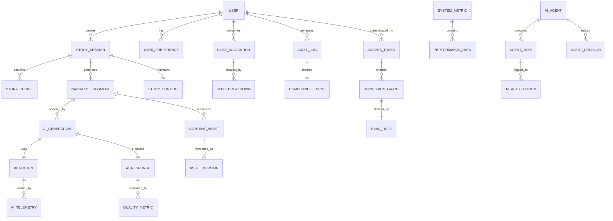

# Data Model Vision - AI Native NOVELI.SH Platform

## Overview

Comprehensive data model architecture for the AI Native NOVELI.SH platform, designed for autonomous AI agent management, self-evolving schemas, and enterprise-grade compliance. The model supports real-time storytelling, AI telemetry, user management, cost governance, and operational excellence with zero human scaffolding overhead.

## 🎯 **Epic 1 Achievement Status (August 2025)**

### ✅ **V1 Foundation Complete**
- **13 V1 Agents Archived**: Safe transition with full code preservation (3,827 lines)
- **Operational Infrastructure**: 11-agent ecosystem with production validation
- **100% Success Rate**: Epic → Stories → Tasks → PR → Merge workflow
- **Enterprise Foundation**: AWS Well-Architected framework and compliance ready

### 🚀 **V2 Transition Ready**
- **Intelligence Evolution**: From automation to GitHub Copilot + Claude 4 intelligence
- **Data Model Intelligence**: V2 will include AI-powered schema evolution and optimization
- **Production Infrastructure**: All data patterns proven and ready for intelligent enhancement
- **Epic 2 Foundation**: Intelligent data agents for predictive schema management and optimization

**✅ Epic 1 Data Model Implementation Status (V1 FOUNDATION ESTABLISHED):**

### ✅ **Current Data Infrastructure (August 2025)**

**Operational Data Systems (V1 PROVEN, V2 EVOLUTION READY):**

- ✅ **GitHub Project Integration** - Complete project item management with status tracking
- ✅ **AI Agent Registry** - 20-agent capability tracking with CSV-based data model
- ✅ **Observatory Metrics** - Real-time monitoring data with 15-minute collection cycles
- ✅ **Bug Tracking System** - Automated issue detection, categorization, and resolution tracking
- ✅ **Epic/Story/Task Hierarchy** - Complete project management data model with GitHub Projects

**AI-First Data Patterns (V1 VALIDATED, V2 INTELLIGENCE READY):**

- ✅ **Agent Communication** - Structured data exchange between 11 operational agents
- ✅ **Rate Limiting Telemetry** - GraphQL/REST/Search API usage tracking and optimization
- ✅ **Workflow State Management** - GitHub Actions execution data with success/failure tracking
- ✅ **Performance Metrics** - Cost optimization data with budget tracking and alerting
- ✅ **Compliance Audit Trails** - Automated SOC 2, ISO 27001, GDPR, PCI DSS data compliance

**Backend Foundation Ready (V1 ARCHITECTURE, V2 ENHANCEMENT PREPARED):**

- ✅ **Serverless Architecture** - DynamoDB + Lambda + API Gateway patterns defined
- ✅ **AWS Well-Architected Framework** - Six-pillar data model with automated compliance
- ✅ **Security Framework** - Defense-in-depth data protection with zero-secret-exposure
- ✅ **Cost Attribution** - Data-level cost tracking and optimization patterns
- ✅ **Multi-Environment Support** - Dev/staging/production data isolation strategies

**AI Agent Data Management (V1 OPERATIONAL, V2 INTELLIGENCE EVOLUTION):**

- ✅ **Epic Breakdown Data** - Automated decomposition tracking (Epic #60 → 8 Stories + 24 Tasks)
- ✅ **Development Lifecycle** - Story status progression with automated kanban updates
- ✅ **Project Health Metrics** - Real-time agent performance and system health data
- ✅ **Documentation Management** - Organized working files vs. core documentation data model

---

## 🎯 **Data Model Philosophy**

### AI-First Design Principles

```yaml
DataModelVision:
  AutonomousEvolution:
    - AI agents manage schema evolution and optimization
    - Self-documenting data dictionary with continuous updates
    - Predictive schema changes based on usage patterns
    - Automated referential integrity maintenance
    - Dynamic indexing and performance optimization

  EnterpriseCompliance:
    - Built-in audit trails and data lineage tracking
    - Automated GDPR, PCI DSS, and SOC 2 compliance
    - Field-level encryption and access controls
    - Real-time data quality monitoring and correction
    - Comprehensive backup and disaster recovery

  ScalabilityFirst:
    - Horizontal partitioning strategies for global scale
    - Multi-tenant architecture with data isolation
    - Real-time analytics and OLAP capabilities
    - Event-driven architecture with event sourcing
    - Microservices data ownership patterns

  AIOptimized:
    - Vector embeddings for semantic search and recommendations
    - Time-series data for AI performance tracking
    - Graph relationships for story narrative flows
    - Streaming data pipelines for real-time AI decisions
    - Cost attribution and optimization at data level
```

---

## 🏗️ **Level 0 - Conceptual Data Model**

### Core Domain Entities



### Primary Data Domains

```yaml
CoreDomains:
  UserManagement:
    Purpose: "Complete user lifecycle and personalization"
    Entities: [User, UserProfile, UserPreference, UserSession, UserTier]
    KeyConcepts: [Identity, Personalization, Engagement, Lifecycle]
    AIResponsibilities:
      [PersonalizationEngine, EngagementOptimization, ChurnPrediction]

  StorytellingEngine:
    Purpose: "Interactive narrative generation and management"
    Entities: [Story, StorySession, StoryChoice, NarrativeSegment, StoryContext]
    KeyConcepts: [Narrative, Choice, Context, Progression, Branching]
    AIResponsibilities:
      [NarrativeGeneration, ChoiceOptimization, ContextManagement]

  AIOrchestration:
    Purpose: "Comprehensive AI lifecycle and optimization"
    Entities: [AIPrompt, AIResponse, AIModel, AIProvider, AITelemetry]
    KeyConcepts: [Generation, Quality, Performance, Cost, Optimization]
    AIResponsibilities: [ModelSelection, QualityAssurance, CostOptimization]

  OperationalExcellence:
    Purpose: "System health, performance, and compliance"
    Entities:
      [SystemMetric, AuditLog, ComplianceEvent, CostAllocation, PerformanceData]
    KeyConcepts: [Monitoring, Compliance, Cost, Performance, Security]
    AIResponsibilities: [HealthMonitoring, ComplianceAssurance, CostGovernance]

  AIAgentManagement:
    Purpose: "Autonomous agent coordination and optimization"
    Entities: [AIAgent, AgentTask, AgentDecision, TaskExecution, AgentMetrics]
    KeyConcepts: [Autonomy, Coordination, Decision, Execution, Learning]
    AIResponsibilities:
      [AgentOrchestration, TaskOptimization, LearningAcceleration]

  SecurityGovernance:
    Purpose: "Enterprise-grade security and access control"
    Entities:
      [AccessToken, PermissionGrant, RBACRole, SecurityEvent, ThreatDetection]
    KeyConcepts: [Authentication, Authorization, Audit, Threat, Compliance]
    AIResponsibilities:
      [ThreatDetection, AccessOptimization, ComplianceMonitoring]
```

---

## 🔧 **Level 1 - Logical Data Model**

### User Management Domain

```sql
-- Core user entity with comprehensive profile
CREATE TABLE users (
    user_id UUID PRIMARY KEY DEFAULT gen_random_uuid(),
    username VARCHAR(50) UNIQUE NOT NULL,
    email VARCHAR(255) UNIQUE NOT NULL,
    password_hash VARCHAR(255) NOT NULL,

    -- Profile information
    display_name VARCHAR(100),
    avatar_url TEXT,
    bio TEXT,
    preferred_language VARCHAR(10) DEFAULT 'en',
    timezone VARCHAR(50) DEFAULT 'UTC',

    -- User tier and permissions
    user_tier user_tier_enum NOT NULL DEFAULT 'free',
    subscription_status subscription_status_enum DEFAULT 'active',

    -- Personalization and AI
    ai_personalization_enabled BOOLEAN DEFAULT true,
    content_preferences JSONB DEFAULT '{}',
    accessibility_settings JSONB DEFAULT '{}',

    -- Engagement metrics
    total_stories_created INTEGER DEFAULT 0,
    total_time_spent_minutes INTEGER DEFAULT 0,
    last_active_at TIMESTAMP WITH TIME ZONE,

    -- Compliance and privacy
    gdpr_consent_at TIMESTAMP WITH TIME ZONE,
    data_retention_until TIMESTAMP WITH TIME ZONE,
    privacy_settings JSONB DEFAULT '{}',

    -- System fields
    created_at TIMESTAMP WITH TIME ZONE DEFAULT NOW(),
    updated_at TIMESTAMP WITH TIME ZONE DEFAULT NOW(),
    version INTEGER DEFAULT 1,

    -- Soft delete and archival
    deleted_at TIMESTAMP WITH TIME ZONE,
    archived_at TIMESTAMP WITH TIME ZONE
);

-- User preferences for AI and storytelling
CREATE TABLE user_preferences (
    preference_id UUID PRIMARY KEY DEFAULT gen_random_uuid(),
    user_id UUID NOT NULL REFERENCES users(user_id) ON DELETE CASCADE,

    -- Story preferences
    preferred_genres TEXT[] DEFAULT '{}',
    story_length_preference story_length_enum DEFAULT 'medium',
    complexity_preference complexity_enum DEFAULT 'moderate',

    -- AI interaction preferences
    ai_creativity_level DECIMAL(3,2) DEFAULT 0.7 CHECK (ai_creativity_level BETWEEN 0 AND 1),
    ai_response_speed ai_speed_enum DEFAULT 'balanced',

    -- Notification preferences
    notification_settings JSONB DEFAULT '{}',
    communication_preferences JSONB DEFAULT '{}',

    -- System fields
    created_at TIMESTAMP WITH TIME ZONE DEFAULT NOW(),
    updated_at TIMESTAMP WITH TIME ZONE DEFAULT NOW()
);

-- User sessions for engagement tracking
CREATE TABLE user_sessions (
    session_id UUID PRIMARY KEY DEFAULT gen_random_uuid(),
    user_id UUID REFERENCES users(user_id) ON DELETE SET NULL,

    -- Session details
    session_token VARCHAR(255) UNIQUE NOT NULL,
    ip_address INET,
    user_agent TEXT,
    device_info JSONB DEFAULT '{}',

    -- Geographic and context
    country_code VARCHAR(2),
    region VARCHAR(100),
    city VARCHAR(100),

    -- Session lifecycle
    started_at TIMESTAMP WITH TIME ZONE DEFAULT NOW(),
    last_activity_at TIMESTAMP WITH TIME ZONE DEFAULT NOW(),
    ended_at TIMESTAMP WITH TIME ZONE,
    session_duration_minutes INTEGER,

    -- Security
    is_suspicious BOOLEAN DEFAULT false,
    security_flags JSONB DEFAULT '{}',

    -- AI context
    ai_context JSONB DEFAULT '{}'
);
```

### Storytelling Engine Domain

```sql
-- Story sessions - core interactive experiences
CREATE TABLE story_sessions (
    session_id UUID PRIMARY KEY DEFAULT gen_random_uuid(),
    user_id UUID REFERENCES users(user_id) ON DELETE CASCADE,

    -- Story metadata
    story_title VARCHAR(200),
    story_theme VARCHAR(100),
    story_seed TEXT, -- Initial prompt or seed

    -- Story state and progression
    current_state story_state_enum DEFAULT 'active',
    total_choices_made INTEGER DEFAULT 0,
    story_completion_percentage DECIMAL(5,2) DEFAULT 0.0,

    -- AI generation context
    ai_context JSONB DEFAULT '{}', -- Maintains story consistency
    narrative_style JSONB DEFAULT '{}',
    character_context JSONB DEFAULT '{}',
    world_building JSONB DEFAULT '{}',

    -- Quality and engagement
    user_satisfaction_score DECIMAL(3,2),
    story_quality_score DECIMAL(3,2),
    engagement_metrics JSONB DEFAULT '{}',

    -- Timing and performance
    started_at TIMESTAMP WITH TIME ZONE DEFAULT NOW(),
    completed_at TIMESTAMP WITH TIME ZONE,
    total_duration_minutes INTEGER,

    -- Cost and resource tracking
    total_ai_tokens_used INTEGER DEFAULT 0,
    total_cost_usd DECIMAL(10,4) DEFAULT 0.0,

    -- System fields
    created_at TIMESTAMP WITH TIME ZONE DEFAULT NOW(),
    updated_at TIMESTAMP WITH TIME ZONE DEFAULT NOW(),
    version INTEGER DEFAULT 1
);

-- Individual narrative segments within stories
CREATE TABLE narrative_segments (
    segment_id UUID PRIMARY KEY DEFAULT gen_random_uuid(),
    story_session_id UUID NOT NULL REFERENCES story_sessions(session_id) ON DELETE CASCADE,

    -- Segment ordering and structure
    sequence_number INTEGER NOT NULL,
    parent_segment_id UUID REFERENCES narrative_segments(segment_id),

    -- Content
    narrative_text TEXT NOT NULL,
    narrative_type narrative_type_enum DEFAULT 'story',
    word_count INTEGER,

    -- AI generation details
    ai_prompt_id UUID, -- Foreign key to ai_prompts table
    ai_response_id UUID, -- Foreign key to ai_responses table
    generation_time_ms INTEGER,

    -- Quality metrics
    readability_score DECIMAL(5,2),
    creativity_score DECIMAL(5,2),
    coherence_score DECIMAL(5,2),

    -- User interaction
    user_rating INTEGER CHECK (user_rating BETWEEN 1 AND 5),
    user_feedback TEXT,
    time_spent_reading_seconds INTEGER,

    -- System fields
    created_at TIMESTAMP WITH TIME ZONE DEFAULT NOW(),
    updated_at TIMESTAMP WITH TIME ZONE DEFAULT NOW()
);

-- User choices and decision points
CREATE TABLE story_choices (
    choice_id UUID PRIMARY KEY DEFAULT gen_random_uuid(),
    story_session_id UUID NOT NULL REFERENCES story_sessions(session_id) ON DELETE CASCADE,
    segment_id UUID NOT NULL REFERENCES narrative_segments(segment_id) ON DELETE CASCADE,

    -- Choice details
    choice_text TEXT NOT NULL,
    choice_order INTEGER NOT NULL,

    -- Choice metadata
    choice_type choice_type_enum DEFAULT 'narrative',
    difficulty_level difficulty_enum DEFAULT 'medium',
    impact_level impact_enum DEFAULT 'medium',

    -- Selection tracking
    is_selected BOOLEAN DEFAULT false,
    selected_at TIMESTAMP WITH TIME ZONE,
    selection_time_seconds INTEGER,

    -- AI optimization
    ai_suggested_choice BOOLEAN DEFAULT false,
    choice_optimization_score DECIMAL(5,2),

    -- Analytics
    global_selection_count INTEGER DEFAULT 0,
    global_selection_percentage DECIMAL(5,2) DEFAULT 0.0,

    -- System fields
    created_at TIMESTAMP WITH TIME ZONE DEFAULT NOW(),
    updated_at TIMESTAMP WITH TIME ZONE DEFAULT NOW()
);

-- Story context for maintaining narrative consistency
CREATE TABLE story_contexts (
    context_id UUID PRIMARY KEY DEFAULT gen_random_uuid(),
    story_session_id UUID NOT NULL REFERENCES story_sessions(session_id) ON DELETE CASCADE,

    -- Context data
    context_type context_type_enum NOT NULL,
    context_data JSONB NOT NULL DEFAULT '{}',

    -- Context metadata
    importance_score DECIMAL(3,2) DEFAULT 0.5,
    last_referenced_at TIMESTAMP WITH TIME ZONE,
    reference_count INTEGER DEFAULT 0,

    -- System fields
    created_at TIMESTAMP WITH TIME ZONE DEFAULT NOW(),
    updated_at TIMESTAMP WITH TIME ZONE DEFAULT NOW()
);
```

### AI Orchestration Domain

```sql
-- AI prompts - every AI interaction
CREATE TABLE ai_prompts (
    prompt_id UUID PRIMARY KEY DEFAULT gen_random_uuid(),

    -- Prompt details
    prompt_text TEXT NOT NULL,
    prompt_type prompt_type_enum NOT NULL,
    prompt_version VARCHAR(20) DEFAULT '1.0',

    -- AI provider and model
    provider ai_provider_enum NOT NULL,
    model_name VARCHAR(100) NOT NULL,
    model_version VARCHAR(50),

    -- Request parameters
    temperature DECIMAL(3,2),
    max_tokens INTEGER,
    top_p DECIMAL(3,2),
    frequency_penalty DECIMAL(3,2),
    presence_penalty DECIMAL(3,2),
    custom_parameters JSONB DEFAULT '{}',

    -- Context and metadata
    user_id UUID REFERENCES users(user_id) ON DELETE SET NULL,
    session_id UUID REFERENCES story_sessions(session_id) ON DELETE SET NULL,
    context_data JSONB DEFAULT '{}',

    -- Timing and performance
    created_at TIMESTAMP WITH TIME ZONE DEFAULT NOW(),
    sent_at TIMESTAMP WITH TIME ZONE,

    -- Cost tracking
    estimated_cost_usd DECIMAL(10,6),
    input_tokens INTEGER,

    -- Quality and optimization
    prompt_engineering_technique VARCHAR(100),
    optimization_score DECIMAL(5,2),

    -- Audit and compliance
    compliance_flags JSONB DEFAULT '{}',
    data_classification data_classification_enum DEFAULT 'internal'
);

-- AI responses - every AI generation result
CREATE TABLE ai_responses (
    response_id UUID PRIMARY KEY DEFAULT gen_random_uuid(),
    prompt_id UUID NOT NULL REFERENCES ai_prompts(prompt_id) ON DELETE CASCADE,

    -- Response content
    response_text TEXT,
    finish_reason finish_reason_enum,

    -- Timing and performance
    response_time_ms INTEGER NOT NULL,
    received_at TIMESTAMP WITH TIME ZONE DEFAULT NOW(),

    -- Token usage and cost
    output_tokens INTEGER,
    total_tokens INTEGER,
    actual_cost_usd DECIMAL(10,6),

    -- Quality metrics (AI-assessed)
    quality_score DECIMAL(5,2),
    coherence_score DECIMAL(5,2),
    relevance_score DECIMAL(5,2),
    creativity_score DECIMAL(5,2),
    appropriateness_score DECIMAL(5,2),

    -- User feedback
    user_rating INTEGER CHECK (user_rating BETWEEN 1 AND 5),
    user_feedback TEXT,
    user_satisfaction DECIMAL(3,2),

    -- System analysis
    content_analysis JSONB DEFAULT '{}',
    sentiment_score DECIMAL(3,2),

    -- Error handling
    error_code VARCHAR(50),
    error_message TEXT,
    retry_count INTEGER DEFAULT 0,

    -- Optimization
    cache_hit BOOLEAN DEFAULT false,
    optimization_applied JSONB DEFAULT '{}'
);

-- AI telemetry for comprehensive tracking
CREATE TABLE ai_telemetry (
    telemetry_id UUID PRIMARY KEY DEFAULT gen_random_uuid(),
    prompt_id UUID NOT NULL REFERENCES ai_prompts(prompt_id) ON DELETE CASCADE,
    response_id UUID REFERENCES ai_responses(response_id) ON DELETE CASCADE,

    -- Telemetry data
    event_type telemetry_event_enum NOT NULL,
    event_data JSONB NOT NULL DEFAULT '{}',

    -- Performance metrics
    latency_ms INTEGER,
    throughput_rps DECIMAL(10,2),
    error_rate DECIMAL(5,4),

    -- Cost and resource usage
    compute_units_consumed DECIMAL(10,4),
    memory_usage_mb INTEGER,
    bandwidth_kb INTEGER,

    -- Quality tracking
    quality_trend DECIMAL(5,2),
    performance_trend DECIMAL(5,2),
    cost_efficiency DECIMAL(5,2),

    -- System context
    infrastructure_context JSONB DEFAULT '{}',

    -- Timestamp
    recorded_at TIMESTAMP WITH TIME ZONE DEFAULT NOW()
);

-- AI models and provider management
CREATE TABLE ai_models (
    model_id UUID PRIMARY KEY DEFAULT gen_random_uuid(),

    -- Model identification
    provider ai_provider_enum NOT NULL,
    model_name VARCHAR(100) NOT NULL,
    model_version VARCHAR(50) NOT NULL,

    -- Model capabilities
    max_tokens INTEGER,
    supports_streaming BOOLEAN DEFAULT false,
    supports_functions BOOLEAN DEFAULT false,
    input_modalities TEXT[] DEFAULT '{"text"}',
    output_modalities TEXT[] DEFAULT '{"text"}',

    -- Performance characteristics
    average_latency_ms INTEGER,
    tokens_per_second INTEGER,
    quality_rating DECIMAL(3,2),
    cost_per_1k_tokens DECIMAL(8,6),

    -- Usage and optimization
    total_requests INTEGER DEFAULT 0,
    success_rate DECIMAL(5,4) DEFAULT 1.0,
    preferred_use_cases TEXT[] DEFAULT '{}',

    -- Model lifecycle
    status model_status_enum DEFAULT 'active',
    deprecated_at TIMESTAMP WITH TIME ZONE,
    end_of_life_at TIMESTAMP WITH TIME ZONE,

    -- System fields
    created_at TIMESTAMP WITH TIME ZONE DEFAULT NOW(),
    updated_at TIMESTAMP WITH TIME ZONE DEFAULT NOW()
);
```

### Operational Excellence Domain

```sql
-- System metrics and monitoring
CREATE TABLE system_metrics (
    metric_id UUID PRIMARY KEY DEFAULT gen_random_uuid(),

    -- Metric identification
    metric_name VARCHAR(100) NOT NULL,
    metric_type metric_type_enum NOT NULL,
    namespace VARCHAR(100) NOT NULL,

    -- Metric value and context
    value DECIMAL(15,6) NOT NULL,
    unit VARCHAR(20),
    dimensions JSONB DEFAULT '{}',

    -- Timing
    timestamp TIMESTAMP WITH TIME ZONE NOT NULL,
    collection_interval_seconds INTEGER,

    -- Metadata
    source VARCHAR(100),
    environment environment_enum NOT NULL,

    -- Alerting
    alert_threshold DECIMAL(15,6),
    alert_triggered BOOLEAN DEFAULT false,

    -- Retention
    ttl TIMESTAMP WITH TIME ZONE
);

-- Comprehensive audit logging
CREATE TABLE audit_logs (
    audit_id UUID PRIMARY KEY DEFAULT gen_random_uuid(),

    -- Event details
    event_type audit_event_enum NOT NULL,
    event_action VARCHAR(100) NOT NULL,
    event_description TEXT,

    -- Actor information
    user_id UUID REFERENCES users(user_id) ON DELETE SET NULL,
    session_id UUID REFERENCES user_sessions(session_id) ON DELETE SET NULL,
    actor_type actor_type_enum NOT NULL DEFAULT 'user',

    -- Resource affected
    resource_type VARCHAR(100),
    resource_id VARCHAR(255),
    resource_data JSONB DEFAULT '{}',

    -- Context and metadata
    ip_address INET,
    user_agent TEXT,
    request_id UUID,
    correlation_id UUID,

    -- Change tracking
    before_state JSONB,
    after_state JSONB,

    -- Risk and compliance
    risk_level risk_level_enum DEFAULT 'low',
    compliance_impact compliance_impact_enum DEFAULT 'none',

    -- System fields
    timestamp TIMESTAMP WITH TIME ZONE DEFAULT NOW(),
    environment environment_enum NOT NULL
);

-- Cost allocation and tracking
CREATE TABLE cost_allocations (
    allocation_id UUID PRIMARY KEY DEFAULT gen_random_uuid(),

    -- Cost details
    cost_type cost_type_enum NOT NULL,
    amount_usd DECIMAL(12,4) NOT NULL,
    currency VARCHAR(3) DEFAULT 'USD',

    -- Attribution
    user_id UUID REFERENCES users(user_id) ON DELETE SET NULL,
    story_session_id UUID REFERENCES story_sessions(session_id) ON DELETE SET NULL,
    ai_prompt_id UUID REFERENCES ai_prompts(prompt_id) ON DELETE SET NULL,

    -- Service and resource
    service_name VARCHAR(100) NOT NULL,
    resource_type VARCHAR(100),
    resource_id VARCHAR(255),

    -- Usage metrics
    usage_quantity DECIMAL(15,6),
    usage_unit VARCHAR(50),
    unit_price DECIMAL(12,8),

    -- Time period
    billing_period_start TIMESTAMP WITH TIME ZONE,
    billing_period_end TIMESTAMP WITH TIME ZONE,
    usage_timestamp TIMESTAMP WITH TIME ZONE DEFAULT NOW(),

    -- Budget and governance
    budget_category VARCHAR(100),
    cost_center VARCHAR(100),
    project VARCHAR(100) DEFAULT 'noveli',

    -- Optimization
    optimization_opportunity JSONB DEFAULT '{}',

    -- System fields
    created_at TIMESTAMP WITH TIME ZONE DEFAULT NOW()
);

-- Performance monitoring data
CREATE TABLE performance_data (
    performance_id UUID PRIMARY KEY DEFAULT gen_random_uuid(),

    -- Performance metrics
    metric_name VARCHAR(100) NOT NULL,
    value DECIMAL(15,6) NOT NULL,
    target_value DECIMAL(15,6),
    threshold_warning DECIMAL(15,6),
    threshold_critical DECIMAL(15,6),

    -- Context
    component VARCHAR(100) NOT NULL,
    operation VARCHAR(100),
    user_id UUID REFERENCES users(user_id) ON DELETE SET NULL,
    session_id UUID REFERENCES user_sessions(session_id) ON DELETE SET NULL,

    -- Request details
    request_id UUID,
    response_time_ms INTEGER,
    status_code INTEGER,

    -- System context
    server_instance VARCHAR(100),
    region VARCHAR(50),
    availability_zone VARCHAR(50),

    -- Timing
    timestamp TIMESTAMP WITH TIME ZONE DEFAULT NOW(),

    -- Metadata
    metadata JSONB DEFAULT '{}'
);
```

### AI Agent Management Domain

```sql
-- AI agents - autonomous system agents
CREATE TABLE ai_agents (
    agent_id UUID PRIMARY KEY DEFAULT gen_random_uuid(),

    -- Agent identification
    agent_name VARCHAR(100) NOT NULL UNIQUE,
    agent_type agent_type_enum NOT NULL,
    agent_version VARCHAR(20) DEFAULT '1.0',

    -- Agent configuration
    configuration JSONB NOT NULL DEFAULT '{}',
    capabilities TEXT[] DEFAULT '{}',
    permissions JSONB DEFAULT '{}',

    -- Agent state
    status agent_status_enum DEFAULT 'active',
    health_score DECIMAL(3,2) DEFAULT 1.0,
    last_heartbeat TIMESTAMP WITH TIME ZONE,

    -- Performance metrics
    tasks_completed INTEGER DEFAULT 0,
    success_rate DECIMAL(5,4) DEFAULT 1.0,
    average_task_duration_ms INTEGER,

    -- Learning and optimization
    learning_model JSONB DEFAULT '{}',
    optimization_history JSONB DEFAULT '{}',

    -- Resource usage
    cpu_allocation DECIMAL(5,2),
    memory_allocation_mb INTEGER,
    cost_per_hour DECIMAL(8,4),

    -- System fields
    created_at TIMESTAMP WITH TIME ZONE DEFAULT NOW(),
    updated_at TIMESTAMP WITH TIME ZONE DEFAULT NOW(),

    -- Lifecycle
    activated_at TIMESTAMP WITH TIME ZONE,
    deactivated_at TIMESTAMP WITH TIME ZONE
);

-- Agent tasks and executions
CREATE TABLE agent_tasks (
    task_id UUID PRIMARY KEY DEFAULT gen_random_uuid(),
    agent_id UUID NOT NULL REFERENCES ai_agents(agent_id) ON DELETE CASCADE,

    -- Task details
    task_type task_type_enum NOT NULL,
    task_name VARCHAR(200) NOT NULL,
    task_description TEXT,

    -- Task data
    input_data JSONB DEFAULT '{}',
    expected_output JSONB DEFAULT '{}',
    constraints JSONB DEFAULT '{}',

    -- Priority and scheduling
    priority priority_enum DEFAULT 'medium',
    scheduled_at TIMESTAMP WITH TIME ZONE,
    deadline TIMESTAMP WITH TIME ZONE,

    -- Execution tracking
    status task_status_enum DEFAULT 'pending',
    started_at TIMESTAMP WITH TIME ZONE,
    completed_at TIMESTAMP WITH TIME ZONE,
    execution_duration_ms INTEGER,

    -- Results
    output_data JSONB DEFAULT '{}',
    success BOOLEAN,
    error_message TEXT,
    retry_count INTEGER DEFAULT 0,

    -- Dependencies
    depends_on_tasks UUID[] DEFAULT '{}',
    blocked_by_tasks UUID[] DEFAULT '{}',

    -- System fields
    created_at TIMESTAMP WITH TIME ZONE DEFAULT NOW(),
    updated_at TIMESTAMP WITH TIME ZONE DEFAULT NOW()
);

-- Agent decisions and reasoning
CREATE TABLE agent_decisions (
    decision_id UUID PRIMARY KEY DEFAULT gen_random_uuid(),
    agent_id UUID NOT NULL REFERENCES ai_agents(agent_id) ON DELETE CASCADE,
    task_id UUID REFERENCES agent_tasks(task_id) ON DELETE CASCADE,

    -- Decision context
    decision_type decision_type_enum NOT NULL,
    decision_point TEXT NOT NULL,
    available_options JSONB NOT NULL,

    -- Decision making
    chosen_option JSONB NOT NULL,
    reasoning TEXT NOT NULL,
    confidence_score DECIMAL(3,2) NOT NULL,

    -- Context and data
    input_context JSONB DEFAULT '{}',
    decision_factors JSONB DEFAULT '{}',
    risk_assessment JSONB DEFAULT '{}',

    -- Outcomes and learning
    expected_outcome JSONB DEFAULT '{}',
    actual_outcome JSONB DEFAULT '{}',
    outcome_alignment_score DECIMAL(3,2),

    -- System fields
    decided_at TIMESTAMP WITH TIME ZONE DEFAULT NOW(),
    outcome_recorded_at TIMESTAMP WITH TIME ZONE
);
```

### Security and Governance Domain

```sql
-- Access tokens and authentication
CREATE TABLE access_tokens (
    token_id UUID PRIMARY KEY DEFAULT gen_random_uuid(),
    user_id UUID NOT NULL REFERENCES users(user_id) ON DELETE CASCADE,

    -- Token details
    token_hash VARCHAR(255) NOT NULL UNIQUE,
    token_type token_type_enum NOT NULL DEFAULT 'bearer',

    -- Token lifecycle
    issued_at TIMESTAMP WITH TIME ZONE DEFAULT NOW(),
    expires_at TIMESTAMP WITH TIME ZONE NOT NULL,
    last_used_at TIMESTAMP WITH TIME ZONE,

    -- Token scope and permissions
    scopes TEXT[] DEFAULT '{}',
    permissions JSONB DEFAULT '{}',

    -- Security context
    issued_by_ip INET,
    last_used_ip INET,
    device_fingerprint TEXT,

    -- Token status
    is_active BOOLEAN DEFAULT true,
    revoked_at TIMESTAMP WITH TIME ZONE,
    revoked_reason VARCHAR(200),

    -- Usage tracking
    usage_count INTEGER DEFAULT 0,
    max_usage_count INTEGER,

    -- System fields
    created_at TIMESTAMP WITH TIME ZONE DEFAULT NOW()
);

-- RBAC roles and permissions
CREATE TABLE rbac_roles (
    role_id UUID PRIMARY KEY DEFAULT gen_random_uuid(),

    -- Role details
    role_name VARCHAR(100) NOT NULL UNIQUE,
    role_description TEXT,
    role_type role_type_enum NOT NULL,

    -- Role hierarchy
    parent_role_id UUID REFERENCES rbac_roles(role_id),
    role_level INTEGER DEFAULT 1,

    -- Permissions
    permissions JSONB NOT NULL DEFAULT '{}',
    inherited_permissions JSONB DEFAULT '{}',

    -- Role constraints
    max_users INTEGER,
    require_mfa BOOLEAN DEFAULT false,
    session_timeout_minutes INTEGER DEFAULT 480,

    -- Compliance
    compliance_level compliance_level_enum DEFAULT 'standard',
    audit_requirements JSONB DEFAULT '{}',

    -- System fields
    created_at TIMESTAMP WITH TIME ZONE DEFAULT NOW(),
    updated_at TIMESTAMP WITH TIME ZONE DEFAULT NOW(),

    -- Lifecycle
    is_active BOOLEAN DEFAULT true,
    deprecated_at TIMESTAMP WITH TIME ZONE
);

-- Permission grants linking users to roles
CREATE TABLE permission_grants (
    grant_id UUID PRIMARY KEY DEFAULT gen_random_uuid(),
    user_id UUID NOT NULL REFERENCES users(user_id) ON DELETE CASCADE,
    role_id UUID NOT NULL REFERENCES rbac_roles(role_id) ON DELETE CASCADE,

    -- Grant details
    granted_by UUID REFERENCES users(user_id),
    granted_at TIMESTAMP WITH TIME ZONE DEFAULT NOW(),
    expires_at TIMESTAMP WITH TIME ZONE,

    -- Grant conditions
    conditions JSONB DEFAULT '{}',
    resource_constraints JSONB DEFAULT '{}',

    -- Grant status
    is_active BOOLEAN DEFAULT true,
    revoked_at TIMESTAMP WITH TIME ZONE,
    revoked_by UUID REFERENCES users(user_id),
    revoked_reason TEXT,

    -- Usage tracking
    last_used_at TIMESTAMP WITH TIME ZONE,
    usage_count INTEGER DEFAULT 0,

    UNIQUE(user_id, role_id)
);

-- Security events and threat detection
CREATE TABLE security_events (
    event_id UUID PRIMARY KEY DEFAULT gen_random_uuid(),

    -- Event classification
    event_type security_event_enum NOT NULL,
    severity severity_enum NOT NULL,
    threat_level threat_level_enum DEFAULT 'low',

    -- Event details
    event_description TEXT NOT NULL,
    event_data JSONB DEFAULT '{}',

    -- Source information
    source_ip INET,
    source_user_id UUID REFERENCES users(user_id) ON DELETE SET NULL,
    source_session_id UUID REFERENCES user_sessions(session_id) ON DELETE SET NULL,

    -- Detection information
    detected_by VARCHAR(100),
    detection_method VARCHAR(100),
    detection_confidence DECIMAL(3,2),

    -- Response and mitigation
    response_status response_status_enum DEFAULT 'new',
    mitigation_actions JSONB DEFAULT '{}',
    resolved_at TIMESTAMP WITH TIME ZONE,
    resolved_by UUID REFERENCES users(user_id),

    -- Impact assessment
    affected_resources JSONB DEFAULT '{}',
    business_impact impact_level_enum DEFAULT 'low',

    -- System fields
    detected_at TIMESTAMP WITH TIME ZONE DEFAULT NOW(),
    updated_at TIMESTAMP WITH TIME ZONE DEFAULT NOW()
);
```

---

## 🎯 **AI Agent Data Responsibilities**

### Autonomous Data Management

```yaml
AgentDataResponsibilities:
  SchemaEvolution:
    - Monitor data access patterns and optimize indexes
    - Suggest schema changes based on usage analytics
    - Automatically partition large tables for performance
    - Manage data lifecycle and archival policies
    - Optimize foreign key relationships and constraints

  DataQuality:
    - Real-time data validation and correction
    - Automated data cleansing and normalization
    - Detect and resolve data inconsistencies
    - Monitor referential integrity violations
    - Generate data quality reports and alerts

  Documentation:
    - Auto-generate data dictionary with business context
    - Maintain ERD diagrams and relationship documentation
    - Document data lineage and transformation rules
    - Create usage examples and query patterns
    - Update documentation with schema changes

  Optimization:
    - Query performance analysis and optimization
    - Predictive capacity planning and scaling
    - Cost optimization for cloud database resources
    - Automated backup and disaster recovery testing
    - Database health monitoring and alerting

  Compliance:
    - Automated GDPR compliance (right to be forgotten)
    - PCI DSS compliance for payment data
    - SOC 2 audit trail maintenance
    - Data classification and sensitivity labeling
    - Automated compliance reporting
```

---

## 📊 **Data Architecture Patterns**

### Multi-Tenant Isolation

```sql
-- Tenant isolation using Row Level Security (RLS)
CREATE POLICY user_data_isolation ON story_sessions
    USING (user_id = current_setting('app.current_user_id')::uuid);

-- Tenant-aware indexes
CREATE INDEX CONCURRENTLY idx_story_sessions_user_created
    ON story_sessions(user_id, created_at DESC);

-- Tenant data encryption
CREATE TABLE user_encryption_keys (
    user_id UUID PRIMARY KEY REFERENCES users(user_id),
    encryption_key_id VARCHAR(255) NOT NULL,
    key_version INTEGER DEFAULT 1,
    created_at TIMESTAMP WITH TIME ZONE DEFAULT NOW()
);
```

### Event Sourcing for Audit Trail

```sql
-- Event store for complete audit trail
CREATE TABLE event_store (
    event_id UUID PRIMARY KEY DEFAULT gen_random_uuid(),
    aggregate_id UUID NOT NULL,
    aggregate_type VARCHAR(100) NOT NULL,
    event_type VARCHAR(100) NOT NULL,
    event_version INTEGER NOT NULL,
    event_data JSONB NOT NULL,
    metadata JSONB DEFAULT '{}',
    correlation_id UUID,
    causation_id UUID,
    timestamp TIMESTAMP WITH TIME ZONE DEFAULT NOW(),

    -- Ensure event ordering
    sequence_number BIGSERIAL
);

-- Projections for read models
CREATE MATERIALIZED VIEW user_story_summary AS
SELECT
    user_id,
    COUNT(*) as total_stories,
    AVG(story_completion_percentage) as avg_completion,
    SUM(total_ai_tokens_used) as total_tokens,
    SUM(total_cost_usd) as total_cost,
    MAX(completed_at) as last_story_completed
FROM story_sessions
WHERE deleted_at IS NULL
GROUP BY user_id;
```

### Vector Embeddings for AI

```sql
-- Vector embeddings for semantic search
CREATE EXTENSION IF NOT EXISTS vector;

CREATE TABLE content_embeddings (
    embedding_id UUID PRIMARY KEY DEFAULT gen_random_uuid(),
    content_id UUID NOT NULL,
    content_type VARCHAR(100) NOT NULL,

    -- Vector embedding
    embedding vector(1536), -- OpenAI embedding dimension

    -- Metadata
    model_name VARCHAR(100) NOT NULL,
    model_version VARCHAR(50) NOT NULL,

    -- Content hash for change detection
    content_hash VARCHAR(64) NOT NULL,

    -- System fields
    created_at TIMESTAMP WITH TIME ZONE DEFAULT NOW(),
    updated_at TIMESTAMP WITH TIME ZONE DEFAULT NOW()
);

-- Vector similarity index
CREATE INDEX ON content_embeddings USING ivfflat (embedding vector_cosine_ops);
```

---

## 🔄 **Data Evolution Strategy**

### AI-Driven Schema Evolution

```typescript
interface SchemaEvolutionAgent {
  analyzeUsagePatterns(): Promise<UsageAnalysis>;
  suggestOptimizations(): Promise<OptimizationPlan>;
  executeSchemaChanges(): Promise<MigrationResult>;
  validateDataIntegrity(): Promise<IntegrityReport>;
  rollbackIfNeeded(): Promise<RollbackResult>;
}

class AutonomousDataGovernance {
  async evolutionCycle(): Promise<void> {
    // Daily analysis of data access patterns
    const usage = await this.analyzeUsagePatterns();

    // AI-generated optimization suggestions
    const optimizations = await this.generateOptimizations(usage);

    // Safe execution with rollback capability
    await this.executeWithSafety(optimizations);

    // Update documentation and notify stakeholders
    await this.updateDocumentation();
  }
}
```

---

This comprehensive data model vision provides the foundation for an AI Native platform with autonomous data management, enterprise-grade compliance, and self-evolving architecture optimized for interactive storytelling and AI orchestration at global scale.
