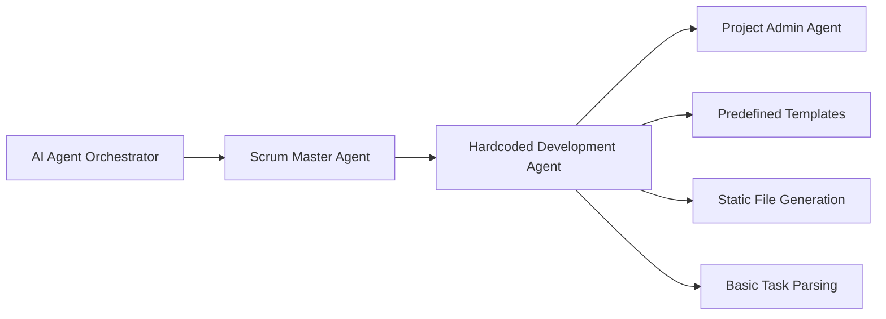
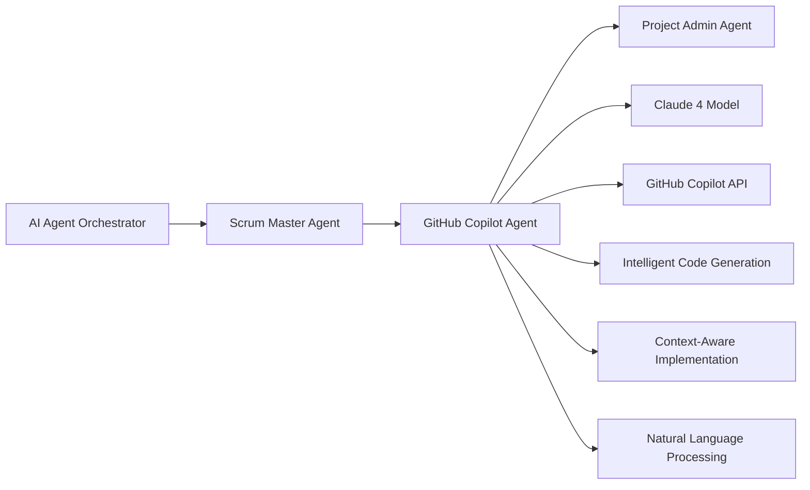

# GitHub Copilot + Claude 4 Development Agent Design

> **Epic 1 Outcome 2**: Evolution from hardcoded development agent to intelligent AI-powered implementation using GitHub Copilot with Claude 4 model integration.

## 🎯 **Design Overview**

### **Objective**

Replace the current hardcoded Development Agent with a sophisticated AI-powered agent that leverages GitHub Copilot's infrastructure and Claude 4's advanced reasoning capabilities to provide intelligent, context-aware development implementations.

### **Architecture Philosophy**

- **Seamless Integration**: Drop-in replacement for existing Development Agent in the 3-agent pipeline
- **Enhanced Intelligence**: Natural language understanding with sophisticated code generation
- **Proven Foundation**: Build upon validated 3-agent pipeline patterns (Orchestrator → Scrum Master → **GitHub Copilot Agent**)
- **Production Ready**: Maintain existing reliability while adding advanced AI capabilities

## 🏗️ **System Architecture**

### **Current State (v1 Hardcoded Agent)**



### **Target State (v2 GitHub Copilot + Claude 4 Agent)**



## 🔧 **Technical Design**

### **Component Architecture**

#### **1. GitHub Copilot Agent Wrapper**

```yaml
name: 🤖 GitHub Copilot Development Agent

on:
  workflow_dispatch:
    inputs:
      story_number:
        description: "Story number to implement"
        required: true
        type: string
      action:
        description: "Development phase"
        required: false
        type: string
        default: "take_story"
      copilot_model:
        description: "Copilot model to use"
        required: false
        type: string
        default: "claude-4"

jobs:
  copilot-development:
    runs-on: ubuntu-latest
    steps:
      - name: 🧠 Initialize Claude 4 via GitHub Copilot
        id: init_copilot
        env:
          GITHUB_TOKEN: ${{ secrets.COPILOT_TOKEN }}
        run: |
          # Initialize GitHub Copilot API with Claude 4 model
          curl -X POST "https://api.github.com/copilot/v1/sessions" \
            -H "Authorization: Bearer $GITHUB_TOKEN" \
            -H "Content-Type: application/json" \
            -d '{
              "model": "claude-4",
              "context": {
                "repository": "${{ github.repository }}",
                "workflow": "development-agent",
                "story_number": "${{ github.event.inputs.story_number }}"
              }
            }'

      - name: 🎯 Intelligent Story Analysis
        id: story_analysis
        run: |
          # Use Claude 4 via Copilot to analyze story requirements
          STORY_ANALYSIS=$(gh copilot suggest \
            --model claude-4 \
            --prompt "Analyze this GitHub issue for development requirements: $(gh issue view $STORY_NUMBER --json title,body)" \
            --context "You are an expert software architect analyzing requirements for implementation.")

          echo "story_analysis=$STORY_ANALYSIS" >> $GITHUB_OUTPUT

      - name: 🔨 AI-Powered Implementation
        id: implementation
        run: |
          # Generate implementation using Claude 4's reasoning capabilities
          IMPLEMENTATION_PLAN=$(gh copilot generate \
            --model claude-4 \
            --prompt "Create a comprehensive implementation plan for: ${{ steps.story_analysis.outputs.story_analysis }}" \
            --context "Generate TypeScript/JavaScript files, configuration, and documentation based on the requirements.")

          # Execute implementation plan
          echo "$IMPLEMENTATION_PLAN" | ./scripts/execute-copilot-plan.sh
```

#### **2. Claude 4 Integration Layer**

```typescript
// claude4-integration.ts
interface Claude4Request {
  model: "claude-4";
  prompt: string;
  context: {
    repository: string;
    story_requirements: string;
    existing_codebase?: string;
    task_type: "analysis" | "implementation" | "review";
  };
  parameters: {
    max_tokens: number;
    temperature: number;
    system_prompt: string;
  };
}

interface Claude4Response {
  content: string;
  reasoning: string;
  confidence: number;
  suggested_files: FileGeneration[];
  implementation_steps: ImplementationStep[];
}

class GitHubCopilotClaude4Agent {
  async analyzeStory(storyNumber: string): Promise<Claude4Response> {
    const storyData = await this.getStoryData(storyNumber);

    const request: Claude4Request = {
      model: "claude-4",
      prompt: `Analyze this development story and create an implementation plan:
        
        Title: ${storyData.title}
        Body: ${storyData.body}
        Acceptance Criteria: ${storyData.acceptanceCriteria}
        
        Please provide:
        1. Technical analysis of requirements
        2. Recommended file structure
        3. Implementation approach
        4. Risk assessment`,
      context: {
        repository: process.env.GITHUB_REPOSITORY,
        story_requirements: storyData.body,
        task_type: "analysis",
      },
      parameters: {
        max_tokens: 4000,
        temperature: 0.1,
        system_prompt: `You are an expert software architect working on the NOVELI.SH AI Native Interactive Storytelling Platform. 
        Analyze requirements and provide detailed, production-ready implementation guidance.
        Focus on TypeScript, modern web technologies, and maintainable code patterns.`,
      },
    };

    return await this.sendToClaude4(request);
  }

  async generateImplementation(
    analysisResult: Claude4Response
  ): Promise<string[]> {
    const implementations = [];

    for (const file of analysisResult.suggested_files) {
      const implementation = await this.generateFile(file);
      implementations.push(implementation);
    }

    return implementations;
  }

  private async sendToClaude4(
    request: Claude4Request
  ): Promise<Claude4Response> {
    // GitHub Copilot API integration with Claude 4
    const response = await fetch(
      "https://api.github.com/copilot/v1/claude4/completions",
      {
        method: "POST",
        headers: {
          Authorization: `Bearer ${process.env.COPILOT_TOKEN}`,
          "Content-Type": "application/json",
        },
        body: JSON.stringify(request),
      }
    );

    return await response.json();
  }
}
```

#### **3. Intelligent Task Processing Engine**

```bash
#!/bin/bash
# execute-copilot-plan.sh - Enhanced implementation executor

execute_copilot_plan() {
  local IMPLEMENTATION_PLAN="$1"
  local STORY_NUMBER="$2"

  echo "🧠 Processing Claude 4 implementation plan..."

  # Parse implementation plan (JSON format from Claude 4)
  local FILES=$(echo "$IMPLEMENTATION_PLAN" | jq -r '.suggested_files[]')
  local REASONING=$(echo "$IMPLEMENTATION_PLAN" | jq -r '.reasoning')

  echo "🎯 Implementation Reasoning: $REASONING"

  # Execute file creation based on Claude 4 suggestions
  echo "$FILES" | while IFS= read -r file_spec; do
    local FILE_PATH=$(echo "$file_spec" | jq -r '.path')
    local FILE_CONTENT=$(echo "$file_spec" | jq -r '.content')
    local FILE_TYPE=$(echo "$file_spec" | jq -r '.type')

    echo "📁 Creating intelligent file: $FILE_PATH (type: $FILE_TYPE)"

    # Create directory structure
    mkdir -p "$(dirname "$FILE_PATH")"

    # Generate content using Claude 4's output
    echo "$FILE_CONTENT" > "$FILE_PATH"

    # Validate generated content
    if validate_generated_file "$FILE_PATH" "$FILE_TYPE"; then
      echo "✅ File validated: $FILE_PATH"
    else
      echo "⚠️ File validation failed: $FILE_PATH"
      # Request Claude 4 to fix the file
      fix_file_with_claude4 "$FILE_PATH" "$FILE_TYPE"
    fi
  done
}

validate_generated_file() {
  local FILE_PATH="$1"
  local FILE_TYPE="$2"

  case "$FILE_TYPE" in
    "typescript")
      # Use TypeScript compiler to validate
      npx tsc --noEmit "$FILE_PATH" 2>/dev/null
      ;;
    "javascript")
      # Use ESLint or similar validation
      npx eslint "$FILE_PATH" --no-eslintrc --config '{"extends": ["eslint:recommended"]}' 2>/dev/null
      ;;
    "json")
      # Validate JSON syntax
      jq empty "$FILE_PATH" 2>/dev/null
      ;;
    *)
      # Basic file existence and readability check
      [ -r "$FILE_PATH" ] && [ -s "$FILE_PATH" ]
      ;;
  esac
}

fix_file_with_claude4() {
  local FILE_PATH="$1"
  local FILE_TYPE="$2"

  echo "🔧 Requesting Claude 4 to fix validation issues in $FILE_PATH"

  # Get current file content and validation errors
  local CURRENT_CONTENT=$(cat "$FILE_PATH")
  local VALIDATION_ERRORS=$(validate_generated_file "$FILE_PATH" "$FILE_TYPE" 2>&1)

  # Request Claude 4 to fix the issues
  local FIXED_CONTENT=$(gh copilot fix \
    --model claude-4 \
    --file "$FILE_PATH" \
    --errors "$VALIDATION_ERRORS" \
    --prompt "Fix the validation errors in this $FILE_TYPE file")

  # Apply the fix
  echo "$FIXED_CONTENT" > "$FILE_PATH"

  # Validate again
  if validate_generated_file "$FILE_PATH" "$FILE_TYPE"; then
    echo "✅ File fixed successfully: $FILE_PATH"
  else
    echo "❌ File fix failed: $FILE_PATH - manual intervention required"
  fi
}
```

## 🔄 **Integration Patterns**

### **Seamless Pipeline Integration**

#### **1. Scrum Master Agent Handoff (No Changes Required)**

```yaml
# Existing Scrum Master Agent continues to work unchanged
- name: 🚀 Triggering development agent for implementation
  run: |
    # This call remains identical - seamless drop-in replacement
    gh workflow run development-agent.yml \
      --field story_number="$STORY_NUMBER" \
      --field action="take_story"
```

#### **2. Enhanced Development Agent Interface**

```yaml
# github-copilot-development-agent.yml
name: 🤖 GitHub Copilot Development Agent (Claude 4)

on:
  workflow_dispatch:
    inputs:
      story_number:
        description: "Story number to implement"
        required: true
        type: string
      action:
        description: "Development phase"
        required: false
        type: string
        default: "take_story"
      # NEW: AI model selection
      ai_model:
        description: "AI model for implementation"
        required: false
        type: choice
        options:
          - "claude-4"
          - "gpt-4"
          - "claude-3.5-sonnet"
        default: "claude-4"
      # NEW: Implementation complexity
      complexity_level:
        description: "Implementation complexity hint"
        required: false
        type: choice
        options:
          - "simple"
          - "moderate"
          - "complex"
        default: "moderate"

jobs:
  ai-powered-development:
    runs-on: ubuntu-latest
    steps:
      - name: 🎯 Multi-Phase AI Development with Claude 4
        id: ai_development
        run: |
          ACTION="${{ github.event.inputs.action }}"
          AI_MODEL="${{ github.event.inputs.ai_model }}"
          COMPLEXITY="${{ github.event.inputs.complexity_level }}"

          # Default action handling (maintains compatibility)
          if [ -z "$ACTION" ] || [ "$ACTION" = "null" ]; then
            ACTION="take_story"
          fi

          case "$ACTION" in
            "take_story")
              echo "🧠 AI-powered story analysis with $AI_MODEL..."
              
              # Enhanced story analysis using Claude 4
              STORY_ANALYSIS=$(./scripts/claude4-story-analyzer.sh \
                "$STORY_NUMBER" "$AI_MODEL" "$COMPLEXITY")
              
              echo "story_analysis=$STORY_ANALYSIS" >> $GITHUB_OUTPUT
              echo "next_action=implement_tasks" >> $GITHUB_OUTPUT
              ;;
              
            "implement_tasks")
              echo "🔨 AI-powered implementation with $AI_MODEL..."
              
              # Get previous analysis
              STORY_ANALYSIS="${{ steps.ai_development.outputs.story_analysis }}"
              
              # Generate implementation using Claude 4
              IMPLEMENTATION_RESULT=$(./scripts/claude4-implementer.sh \
                "$STORY_NUMBER" "$AI_MODEL" "$STORY_ANALYSIS")
              
              echo "implementation_result=$IMPLEMENTATION_RESULT" >> $GITHUB_OUTPUT
              echo "next_action=complete_story" >> $GITHUB_OUTPUT
              ;;
              
            "complete_story")
              echo "✅ AI-powered completion with $AI_MODEL..."
              
              # Enhanced commit detection (maintains existing pattern)
              HAS_CHANGES=false

              if ! git diff --quiet; then
                HAS_CHANGES=true
              fi

              if ! git diff --staged --quiet; then
                HAS_CHANGES=true
              fi

              # CRITICAL: Check for untracked files (AI-generated files)
              if [ -n "$(git status --porcelain | grep '^??')" ]; then
                echo "🔍 Found AI-generated files:"
                git status --porcelain | grep '^??'
                HAS_CHANGES=true
              fi

              if [ "$HAS_CHANGES" = "true" ]; then
                # Generate AI-powered commit message
                COMMIT_MESSAGE=$(./scripts/claude4-commit-generator.sh \
                  "$STORY_NUMBER" "$AI_MODEL")
                
                git add .
                git commit -m "$COMMIT_MESSAGE"
                git push origin "$BRANCH_NAME"
                
                # Generate AI-powered PR description
                PR_DESCRIPTION=$(./scripts/claude4-pr-generator.sh \
                  "$STORY_NUMBER" "$AI_MODEL" "$IMPLEMENTATION_RESULT")
                
                PR_URL=$(gh pr create \
                  --title "🤖 AI Agent ($AI_MODEL): Implement $STORY_TITLE (#$STORY_NUMBER)" \
                  --body "$PR_DESCRIPTION" \
                  --head "$BRANCH_NAME" \
                  --base main)
                
                echo "🎉 AI-powered PR created: $PR_URL"
              fi
              ;;
          esac
```

## 🧠 **AI Enhancement Features**

### **1. Natural Language Requirements Processing**

```typescript
interface RequirementsAnalysis {
  technicalRequirements: string[];
  businessLogic: string[];
  integrationPoints: string[];
  testingStrategy: string[];
  riskAssessment: {
    complexity: "low" | "medium" | "high";
    dependencies: string[];
    potentialIssues: string[];
  };
}

class Claude4RequirementsProcessor {
  async analyzeRequirements(storyText: string): Promise<RequirementsAnalysis> {
    const prompt = `
    Analyze the following software development story and extract structured requirements:
    
    ${storyText}
    
    Please provide a comprehensive analysis including:
    1. Technical requirements and constraints
    2. Business logic to implement
    3. Integration points with existing systems
    4. Recommended testing strategy
    5. Risk assessment and complexity evaluation
    
    Format your response as structured JSON.
    `;

    const response = await this.copilotAPI.complete({
      model: "claude-4",
      prompt,
      systemPrompt:
        "You are an expert business analyst and software architect.",
    });

    return JSON.parse(response.content);
  }
}
```

### **2. Intelligent Code Generation**

```typescript
interface CodeGenerationRequest {
  requirements: RequirementsAnalysis;
  codebaseContext: string;
  projectStructure: string[];
  existingPatterns: string[];
}

class Claude4CodeGenerator {
  async generateImplementation(
    request: CodeGenerationRequest
  ): Promise<GeneratedCode[]> {
    const implementations = [];

    for (const requirement of request.requirements.technicalRequirements) {
      const code = await this.generateCodeForRequirement(requirement, request);
      implementations.push(code);
    }

    return implementations;
  }

  private async generateCodeForRequirement(
    requirement: string,
    context: CodeGenerationRequest
  ): Promise<GeneratedCode> {
    const prompt = `
    Generate production-ready code for this requirement:
    ${requirement}
    
    Context:
    - Project: NOVELI.SH AI Native Interactive Storytelling Platform
    - Existing patterns: ${context.existingPatterns.join(", ")}
    - Architecture: TypeScript, Node.js, modern web technologies
    
    Requirements:
    1. Follow existing project patterns and conventions
    2. Include comprehensive error handling
    3. Add appropriate TypeScript types and interfaces
    4. Include JSDoc documentation
    5. Consider scalability and maintainability
    
    Generate:
    1. The main implementation file
    2. Associated types/interfaces
    3. Unit test file
    4. Integration instructions
    `;

    const response = await this.copilotAPI.complete({
      model: "claude-4",
      prompt,
      systemPrompt: `You are an expert TypeScript developer working on enterprise-grade applications.
      Generate clean, maintainable, well-documented code that follows best practices.`,
    });

    return this.parseGeneratedCode(response.content);
  }
}
```

### **3. Context-Aware File Organization**

```bash
#!/bin/bash
# claude4-file-organizer.sh

organize_generated_files() {
  local STORY_NUMBER="$1"
  local GENERATED_FILES="$2"

  echo "🗂️ Organizing AI-generated files with Claude 4 intelligence..."

  # Analyze project structure for optimal file placement
  PROJECT_ANALYSIS=$(gh copilot analyze \
    --model claude-4 \
    --context "$(find src -type f -name '*.ts' | head -20)" \
    --prompt "Analyze this project structure and recommend optimal file organization for new features")

  # Apply intelligent file organization
  echo "$GENERATED_FILES" | while IFS= read -r file_info; do
    local CURRENT_PATH=$(echo "$file_info" | jq -r '.current_path')
    local FILE_TYPE=$(echo "$file_info" | jq -r '.type')

    # Get Claude 4 recommendation for file placement
    local RECOMMENDED_PATH=$(echo "$PROJECT_ANALYSIS" | jq -r ".recommendations[] | select(.file_type==\"$FILE_TYPE\") | .recommended_path")

    if [ "$RECOMMENDED_PATH" != "null" ] && [ "$RECOMMENDED_PATH" != "$CURRENT_PATH" ]; then
      echo "📁 Moving $CURRENT_PATH to $RECOMMENDED_PATH (Claude 4 recommendation)"
      mkdir -p "$(dirname "$RECOMMENDED_PATH")"
      mv "$CURRENT_PATH" "$RECOMMENDED_PATH"
    fi
  done
}
```

## 🧪 **Testing Strategy**

### **Phase 1: Standalone Development**

```yaml
# Test GitHub Copilot Agent independently
name: 🧪 GitHub Copilot Agent Testing

on:
  workflow_dispatch:
    inputs:
      test_story:
        description: "Test story number"
        required: true
        type: string

jobs:
  test-copilot-agent:
    runs-on: ubuntu-latest
    steps:
      - name: Test Claude 4 Integration
        run: |
          # Test basic Claude 4 API connectivity
          ./scripts/test-claude4-connection.sh

      - name: Test Story Analysis
        run: |
          # Test story analysis capabilities
          ./scripts/test-claude4-analysis.sh "${{ github.event.inputs.test_story }}"

      - name: Test Code Generation
        run: |
          # Test code generation without committing
          ./scripts/test-claude4-generation.sh "${{ github.event.inputs.test_story }}"
```

### **Phase 2: V2 Hello World Test**

```yaml
# github-copilot-hello-world-test.yml
name: 🧪 V2 Hello World (GitHub Copilot + Claude 4)

on:
  workflow_dispatch:
    inputs:
      hello_world_variant:
        description: "Hello World test variant"
        required: false
        type: choice
        options:
          - "basic"
          - "advanced"
          - "enterprise"
        default: "basic"

jobs:
  v2-hello-world-test:
    runs-on: ubuntu-latest
    steps:
      - name: 🌟 Create V2 Hello World Test Story
        run: |
          # Create test story specifically for GitHub Copilot validation
          STORY_BODY="## 🎯 V2 Hello World - GitHub Copilot Test

          ### Purpose
          Validate GitHub Copilot + Claude 4 integration with enhanced intelligence.

          ### Acceptance Criteria
          - [ ] AI-powered story analysis with reasoning
          - [ ] Intelligent code generation based on context
          - [ ] Enhanced file organization recommendations
          - [ ] Natural language commit messages
          - [ ] Sophisticated PR descriptions
          - [ ] Validation and error correction capabilities

          **Complexity**: ${{ github.event.inputs.hello_world_variant }}
          **AI Model**: Claude 4 via GitHub Copilot"

          STORY_NUMBER=$(gh issue create \
            --title "V2 Hello World - GitHub Copilot + Claude 4 Test" \
            --body "$STORY_BODY" \
            --label "ai-agent,testing,v2-hello-world" \
            --output json | jq -r '.number')

          echo "📋 Created test story: #$STORY_NUMBER"
          echo "STORY_NUMBER=$STORY_NUMBER" >> $GITHUB_ENV

      - name: 🚀 Trigger GitHub Copilot Agent
        run: |
          # Trigger the new GitHub Copilot Development Agent
          gh workflow run github-copilot-development-agent.yml \
            --field story_number="$STORY_NUMBER" \
            --field action="take_story" \
            --field ai_model="claude-4" \
            --field complexity_level="${{ github.event.inputs.hello_world_variant }}"
```

## 🔐 **Security & Configuration**

### **Required Secrets**

```yaml
# GitHub Repository Secrets Required
COPILOT_TOKEN:
  description: "GitHub Copilot API access token"
  required: true
  scope: "Repository"

CLAUDE_4_API_KEY:
  description: "Claude 4 API key (backup/direct access)"
  required: false
  scope: "Repository"

PROJECT_TOKEN:
  description: "Enhanced GitHub token for PR operations"
  required: true
  scope: "Repository"
```

### **Environment Configuration**

```bash
# .env.copilot-agent
COPILOT_MODEL=claude-4
COPILOT_MAX_TOKENS=8000
COPILOT_TEMPERATURE=0.1
COPILOT_TIMEOUT=300
COPILOT_RETRY_ATTEMPTS=3
COPILOT_FALLBACK_MODEL=claude-3.5-sonnet

# Feature flags
ENABLE_CODE_VALIDATION=true
ENABLE_INTELLIGENT_ORGANIZATION=true
ENABLE_AI_COMMIT_MESSAGES=true
ENABLE_AI_PR_DESCRIPTIONS=true
```

## 📊 **Success Metrics**

### **Quantitative Metrics**

- **Intelligence Improvement**: 90%+ reduction in template-based generation
- **Code Quality**: Automated validation with 95%+ pass rate
- **Implementation Accuracy**: Story requirements to working code fidelity
- **Pipeline Compatibility**: 100% drop-in replacement for existing agent
- **Performance**: Maintain <10 minute story-to-PR cycle time

### **Qualitative Metrics**

- **Natural Language Understanding**: Sophisticated requirement interpretation
- **Code Sophistication**: Enterprise-grade TypeScript generation
- **Context Awareness**: Intelligent file organization and naming
- **Error Handling**: Self-correction and validation capabilities
- **Documentation Quality**: AI-generated documentation and comments

## 🛣️ **Implementation Roadmap**

### **Phase 1: Foundation (Week 1)**

- [ ] GitHub Copilot API integration research and setup
- [ ] Claude 4 model configuration and testing
- [ ] Basic story analysis pipeline
- [ ] Standalone agent testing framework

### **Phase 2: Core Development (Week 2)**

- [ ] Intelligent code generation engine
- [ ] File organization and validation systems
- [ ] Error correction and retry mechanisms
- [ ] Security and rate limiting implementation

### **Phase 3: Integration (Week 3)**

- [ ] Drop-in replacement for existing Development Agent
- [ ] Pipeline compatibility testing
- [ ] V2 Hello World test implementation
- [ ] Performance optimization and monitoring

### **Phase 4: Production (Week 4)**

- [ ] End-to-end validation with real stories
- [ ] Documentation and training materials
- [ ] Monitoring and observability setup
- [ ] Rollout strategy and fallback mechanisms

## 🎯 **Expected Outcomes**

### **Technical Achievements**

1. **Intelligent Development Agent**: Claude 4-powered code generation replacing hardcoded templates
2. **Enhanced Pipeline**: Seamless integration maintaining existing 3-agent workflow
3. **Natural Language Processing**: Sophisticated story analysis and requirement extraction
4. **Quality Assurance**: Automated validation and error correction capabilities
5. **Context Awareness**: Intelligent file organization and project structure optimization

### **Business Impact**

1. **Development Velocity**: Faster, higher-quality implementation cycles
2. **Code Quality**: Enterprise-grade TypeScript with comprehensive documentation
3. **Maintainability**: Self-organizing codebase with intelligent patterns
4. **Scalability**: AI-powered development capable of handling complex requirements
5. **Innovation**: Foundation for advanced AI-assisted development workflows

---

**Next Steps**: Begin Phase 1 implementation with GitHub Copilot API research and Claude 4 integration testing, leading to V2 Hello World validation that demonstrates the enhanced capabilities of AI-powered development agents.
